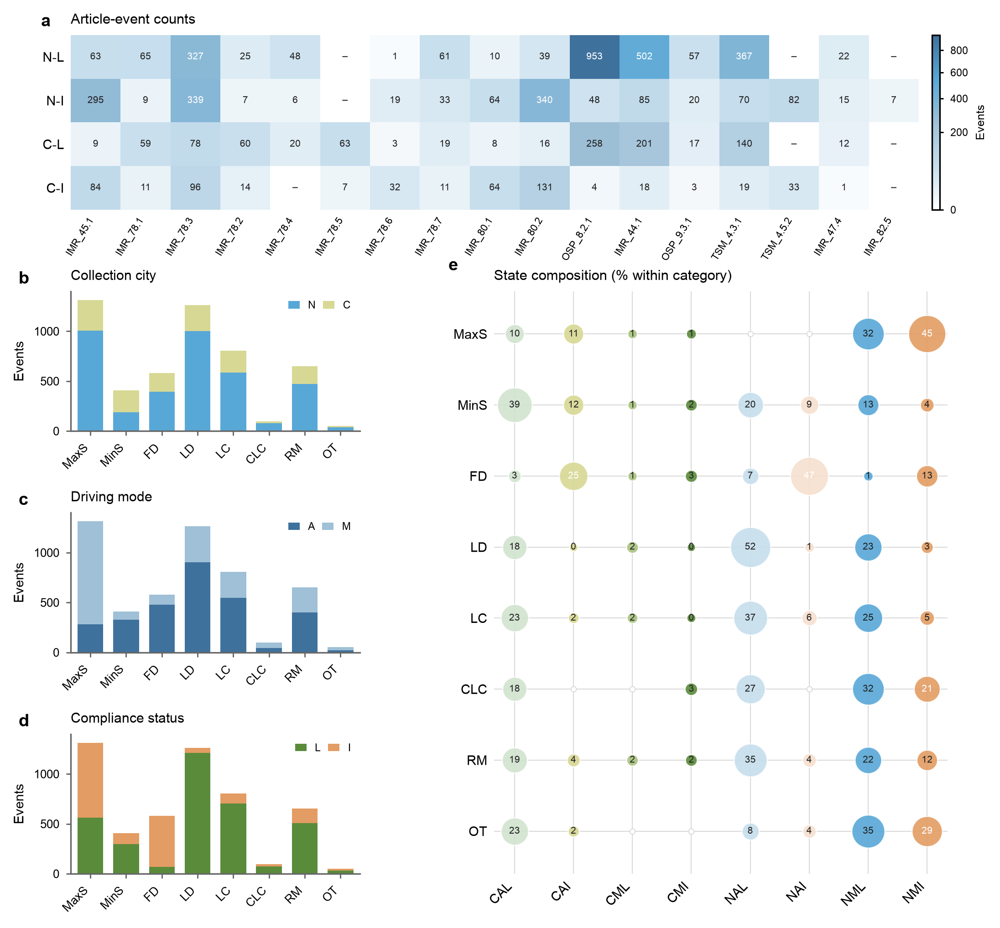

# TLCD 1.0

**TLCD 1.0: A Traffic Law Compliance Dataset for Autonomous Vehicles Based on Legal Driving-Behavior Monitoring**

[中文说明](README_zh-CN.md) · [Dataset documentation](DATASET_INFO.md) · [Manuscript materials](manuscript/) · [Statistics](statistics/)

TLCD 1.0 is an event-level, real-world driving dataset designed for research on traffic-law compliance, autonomous-driving safety, behavior monitoring, and safety-oriented data mining. It was collected with a FAW Hongqi EH7 engineering vehicle on highways and urban expressways in Nanjing and Changchun, China.

<div align="center">
  
</div>

## Highlights

- **5,173 event records** from **2,034.94 km** and **35.18 h** of real-world road tests.
- **Two cities:** Nanjing and Changchun.
- **Eight event categories:** maximum-speed limit, minimum-speed limit, following distance, lateral distance, lane change, continuous lane change, road-marking compliance, and overtaking.
- **17 applicable legal provisions** represented by machine-executable monitoring logic.
- **Seven synchronized camera streams** covering six viewing directions, together with ego-vehicle, fused-object, map, evidence-chain, and event-summary data.
- Both **autonomous driving** and **manual driving** are represented.
- Final event-level compliance labels were manually reviewed; VLM-generated descriptions and driving suggestions are auxiliary annotations and do not determine the labels.

## Dataset overview

| Dimension | Value |
| --- | ---: |
| Event records | 5,173 |
| Nanjing / Changchun | 3,766 / 1,407 |
| Autonomous / manual driving | 2,998 / 2,175 |
| Compliant / violation events | 3,455 / 1,718 |
| Event categories | 8 |
| Applicable legal provisions | 17 |
| Road-test distance | 2,034.94 km |
| Road-test duration | 35.18 h |

<div align="center">
  
</div>

## Data collection

The platform integrates seven cameras, three LiDARs, five millimeter-wave radars, GNSS/INS localization, high-definition maps, and an onboard computing module. A separate Raspberry Pi executed traffic-law-compliance monitoring at 100 Hz. Event-trigger signals caused the recording computer to retain synchronized, category-specific windows rather than continuously storing every trip.

The released dataset includes seven raw camera-video streams plus structured ego, object, map, evidence, and event-summary files. It does **not** include raw LiDAR, raw radar, or raw GNSS/INS measurements.

## Event categories

| Category | Events | Compliant | Violation |
| --- | ---: | ---: | ---: |
| Maximum-speed limit | 1,314 | 562 | 752 |
| Minimum-speed limit | 408 | 295 | 113 |
| Following distance | 581 | 69 | 512 |
| Lateral distance | 1,263 | 1,211 | 52 |
| Lane change | 806 | 703 | 103 |
| Continuous lane change | 97 | 74 | 23 |
| Road-marking compliance | 652 | 507 | 145 |
| Overtaking | 52 | 34 | 18 |

## Repository contents

```text
TLCD/
├── README.md
├── README_zh-CN.md
├── DATASET_INFO.md
├── manuscript/          # Work-in-progress paper source and figures
├── statistics/          # Dataset composition and QA summaries
└── scripts/             # Reproducible statistics and figure scripts
```

The binary dataset package will follow the event-level directory structure documented in [DATASET_INFO.md](DATASET_INFO.md). The repository currently provides the documentation, statistics, manuscript source, and representative scientific figures while the full binary package is prepared for release.

## Access

Clone the repository with:

```bash
git clone https://github.com/SOTIF-AVLab/TLCD.git
```

Dataset release status and download instructions will be maintained in this README. Large video files may be distributed separately from the Git history to keep the repository usable.

## Quality control

- 5,174 candidate event directories were discovered.
- 5,173 valid JSON event records were loaded.
- No JSON parse failures were found among the included records.
- Driving mode, event-level compliance label, applicable provision identifiers, and provision status were complete for all included records.
- One candidate event directory without a valid `record.json` was excluded.

Detailed checks are available in [statistics/dataset_event_statistics.md](statistics/dataset_event_statistics.md).

## Citation

The TLCD manuscript is in preparation. A complete dataset citation, DOI, and BibTeX entry will be added after archival release. Until then, please cite this repository and include the accessed version or commit.

## License

The dataset and software licenses are being finalized. No reuse license is granted by omission; please contact the maintainers before redistributing dataset files or using them beyond evaluation and research review.

## Acknowledgements

TLCD was developed by the Safety Of The Intended Functionality (SOTIF) research team. We acknowledge the contributors involved in vehicle integration, on-road testing, traffic-law formalization, data processing, manual verification, and manuscript preparation.

## Organization

- School of Vehicle and Mobility, Tsinghua University
- Tsinghua Intelligent Vehicle Design and Safety Research Institute
- Safety Of The Intended Functionality (SOTIF) Research Team

